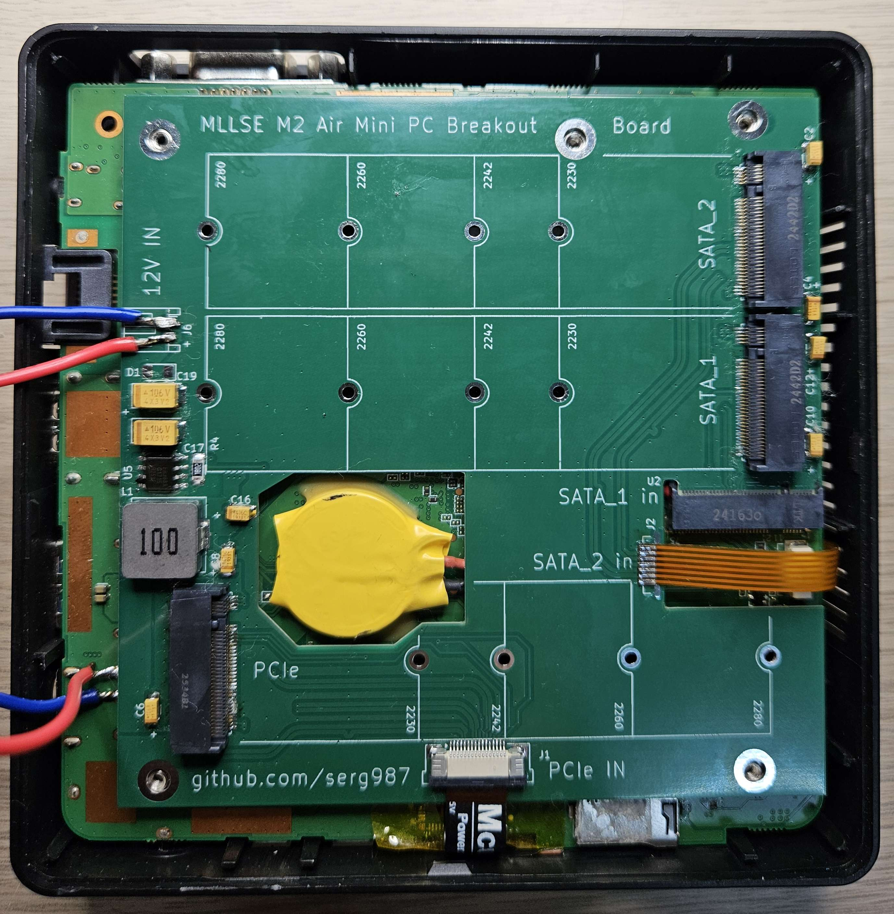
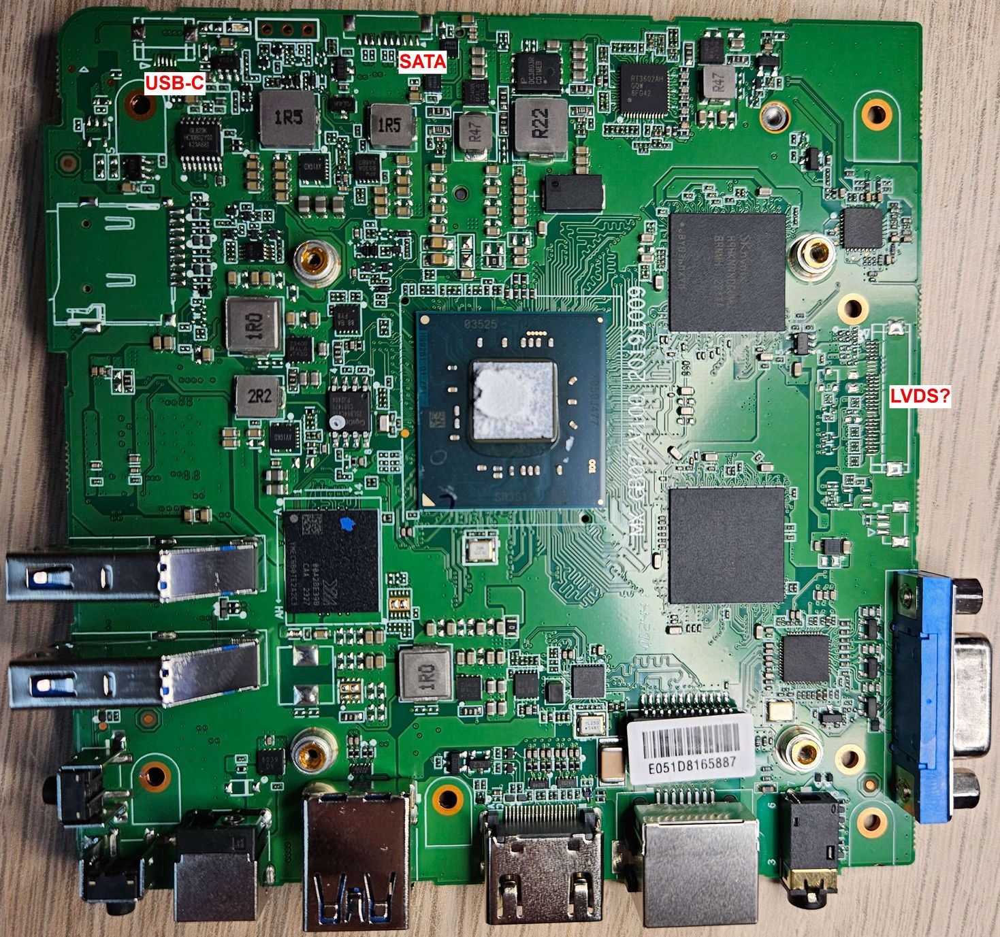
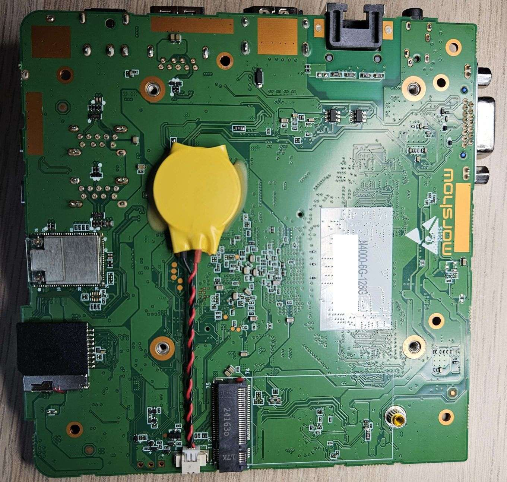
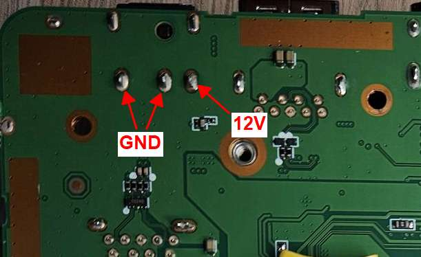
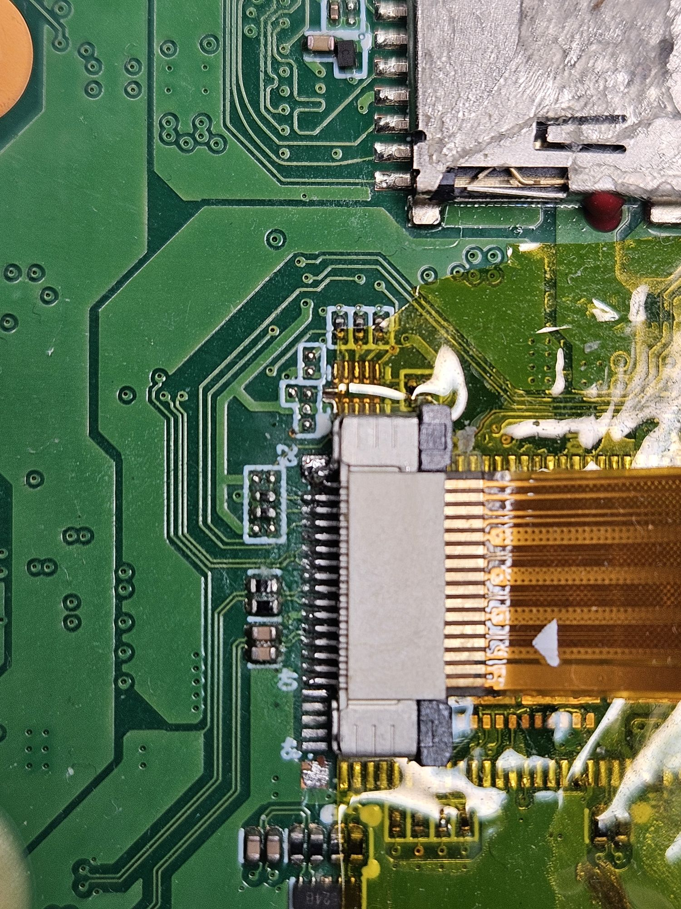
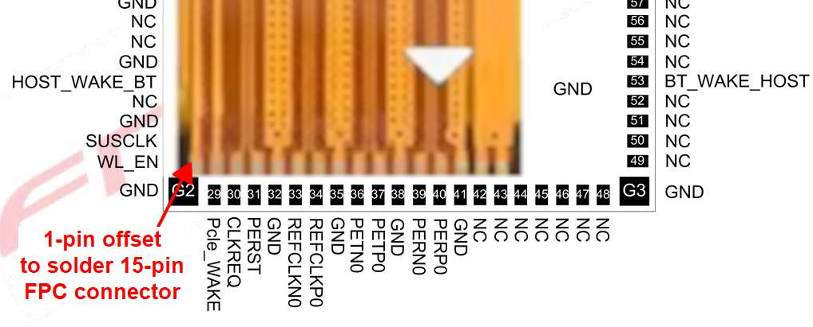
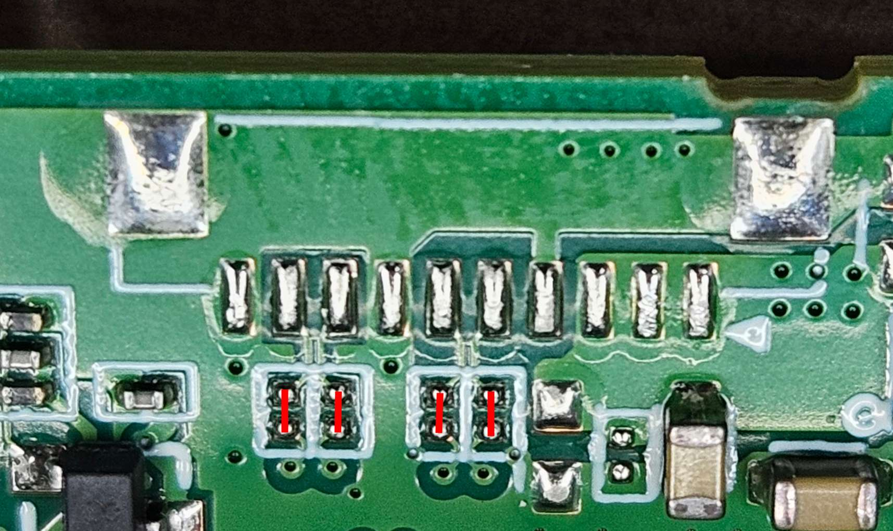

# M.2 Breakout Board for MLLSE M2 Air Mini PC

This project contains the design files and instructions for a breakout board that significantly expands the I/O 
capabilities of the MLLSE M2 Air Mini PC, a compact and affordable x86 machine ideal for homelab projects.

## Table of Contents

- [Motivation](#motivation)
- [Project Overview](#project-overview)
- [Disclaimer](#-disclaimer)
- [Compatibility](#compatibility)
- [The Breakout Board](#the-breakout-board)
  - [Features](#features)
  - [Onboard Power Supply](#onboard-power-supply)
  - [PCB Manufacturing](#pcb-manufacturing)
- [Mainboard Modification Guide](#mainboard-modification-guide)
  - [Step 1: Sourcing 12V Power](#step-1-sourcing-12v-power)
  - [Step 2: Preparing the PCIe Interface](#step-2-preparing-the-pcie-interface)
  - [Step 3: Preparing the Secondary SATA Interface](#step-3-preparing-the-secondary-sata-interface)
- [Bill of Materials (BOM)](#bill-of-materials-bom)
- [Known Issues](#known-issues)

## Motivation

Low-power, small-form-factor computers like mini PCs and Single-Board Computers (SBCs) are excellent choices for 
homelab setups. However, the market can be challenging to navigate. Powerful x86-based options with standard interfaces 
like PCIe and SATA are often expensive, while many non-x86 alternatives lack robust software support and documentation 
(with the notable exception of the Raspberry Pi).

A series of inexpensive Chinese mini PCs, such as the MLLSE M2 Air (based on Intel N4000/N3350 CPUs), offer a 
compelling alternative. They are passively cooled, affordable, and being native x86, they run most software without 
compatibility concerns. For a price comparable to a Raspberry Pi 5 kit, you get a complete system with an enclosure, 
heatsink, and power supply.

However, their primary limitation is a restrictive set of internal interfaces:
- A single M.2 Key-B slot (SATA only) that physically fits only small `<2242` modules.
- A proprietary, unpopulated SATA connector.
- No accessible PCIe lanes for expansion.

This project was born out of a desire to unlock the true potential of this hardware, transforming it from a limited 
device into a versatile server platform.

## Project Overview

This breakout board is designed to overcome the MLLSE M2 Air's I/O limitations. By interfacing with the existing M.2 
slot and repurposing connectors on the mainboard, it provides:

- **Two (2) full-size 2280 M.2 Key-B SATA slots.**
- **One (1) full-size 2280 M.2 Key-M PCIe x1 slot.**

With this board, the mini PC becomes a powerful and flexible platform. It can be used as a Network Video Recorder 
(NVR) with a Google Coral TPU in the PCIe slot and two SATA drives for storage, or as a mini NAS with up to three 
storage devices.

---

## ⚠️ Disclaimer

**This is an advanced hardware modification project that requires significant technical skill, including fine-pitch 
soldering with a hot air station. There is a high risk of permanently damaging your mini PC.**

**Proceed at your own risk. The author of this project assumes no liability for any damage to your equipment, lost time, 
or any other losses incurred while attempting this modification. Please evaluate your skills and equipment before 
starting.**

---

## Compatibility

This breakout board was designed specifically for the **MLLSE M2 Air, PCB version `MX-GB07 V100 20191009`**.

It is highly likely that other PCB versions or models based on different CPUs (e.g., N3350) have different layouts, 
and this board will **not** be compatible with them. While those boards may offer similar modification opportunities, 
they would require a new PCB to be designed from scratch.

## The Breakout Board

The breakout board neatly integrates into the system by plugging into the mainboard's original M.2 slot and is secured 
with M2 standoffs.

### Features

- **PCIe M.2 Key-M Slot:** Taps into the PCIe lanes originally used by the onboard Wi-Fi/Bluetooth module.
- **Two SATA M.2 Key-B Slots:** One slot uses the mainboard's original M.2 connection, and the second uses the 
unpopulated SATA header.
- **Onboard Power Supply:** A DC-DC buck converter provides the stable 3.3V power required for all three M.2 devices.

### Onboard Power Supply

The board includes a DC-DC buck converter based on the FR9889 IC to step down the mainboard's 12V input to the 3.3V 
needed by the M.2 devices. The converter's enable pin is connected to the 3.3V line of the mainboard's M.2 slot, 
ensuring the breakout board powers on and off with the host system.

**🚨 CRITICAL PRECAUTION: After assembling the breakout board, always test the output voltage of the DC-DC converter 
*before* installing any M.2 devices. Ensure it provides a stable 3.3V.**

### PCB Manufacturing

The PCB is designed to be 100x100mm to take advantage of promotional pricing from many manufacturers. It is essential 
that the board is manufactured with a **thickness of 0.8mm**.

The Gerbers can be found in the `/gerbers` directory. You can order the board from any manufacturer 
(e.g., PCBWAY, JLCPCB).

## Mainboard Modification Guide

### Step 1: Sourcing 12V Power

The easiest place to get a 12V supply for the breakout board is directly from the main DC input jack.

### Step 2: Preparing the PCIe Interface

This is the most challenging part of the modification. It requires desoldering the onboard Wi-Fi/Bluetooth module to 
access the PCIe lanes.

1.  **Remove the Wi-Fi Module:** Use a hot air station to carefully desolder the Wi-Fi module. Be aware of the multiple 
ground pads underneath the module and the many small passive components surrounding it. Avoid damaging the 
signal pads.
2.  **Solder the FPC Connector:** Once the module is removed, you need to solder a **16-pin, 0.5mm pitch, 
'bottom' FPC connector**. This connector type and its precise placement are crucial for compatibility with standard 
Raspberry Pi PCIe FPC cables.
    - **Critical Placement:** The connector must be soldered with a **1-pin offset**. Pin 2 of the FPC connector 
should align with pad 29 of the Wi-Fi module footprint.
    - **Insulation:** The underside of the FPC connector may have exposed metal. You must insulate the mainboard pads 
underneath it to prevent short circuits. This means the connector's mounting pads will not be soldered, so handle the 
final connection with care.

A **3cm Raspberry Pi PCIe FPC cable** is sufficient for connecting the mainboard to the breakout board. The breakout 
board requires a **16-pin, 0.5mm pitch, 'top' FPC connector**.

### Step 3: Preparing the Secondary SATA Interface

The unpopulated SATA connector on the mainboard has a rare 0.8mm pitch, making it difficult to find a matching 
connector.

1.  **Use a Solderable FPC:** The most practical solution is to use a 7-pin, 0.8mm pitch solderable FPC cable. 
This creates a permanent, non-flexible connection but is reliable.
2.  **Short Empty Pads:** The SATA signal lanes on the mainboard have empty `0201` component footprints. These must 
be shorted for the signal to pass through. It is best to use `0-ohm 0201` resistors, but a small jumper wire can 
also work.

## Bill of Materials (BOM)

The following components are required to fully assemble the breakout board. The links provided are for illustrative purposes only and are not an endorsement.

| Quantity | Component                                     | Notes                                           | Example Link                                             |
| -------- |-----------------------------------------------| ----------------------------------------------- | -------------------------------------------------------- |
| 6+       | M2 Standoffs, H=2.5mm                         | For mounting the board.                         | [AliExpress](https://www.aliexpress.us/item/3256807359356659.html) |
| 1        | 7-pin Solderable FPC Cable, 0.8mm pitch, 40mm | For the secondary SATA connection.              | [AliExpress](https://www.aliexpress.us/item/3256805836297968.html) |
| 1        | Raspberry Pi PCIe FPC Cable, 30mm             | For the PCIe connection.                        | [AliExpress](https://www.aliexpress.us/item/3256808358195550.html) |
| 1        | FR9889 IC                                     | DC-DC Buck Converter.                           | [AliExpress](https://www.aliexpress.us/item/3256806733161105.html) |
| 1        | 16-Pin FPC Connector, 0.5mm, Top              | For the breakout board's PCIe input.            | [AliExpress](https://www.aliexpress.us/item/3256803795508780.html) |
| 1        | 16-Pin FPC Connector, 0.5mm, Bottom           | For the mainboard's PCIe output.                | [AliExpress](https://www.aliexpress.us/item/3256803795508780.html) |
| 2        | M.2 Key-B Slot, H=4.2mm                       | Height may vary based on standoffs used.        | [AliExpress](https://www.aliexpress.us/item/3256808634409928.html) |
| 1        | M.2 Key-M Slot, H=4.2mm                       | Height may vary based on standoffs used.        | [AliExpress](https://www.aliexpress.us/item/3256808634409928.html) |
| 1        | JST PH Connector, 2-pin, 2.0mm                | For 12V power input.                            | [AliExpress](https://www.aliexpress.us/item/3256808498055527.html) |
| 1        | Inductor, 10uH                                | Wuerth_HCI-1040 or equivalent.                  | -                                                        |
| 2        | Capacitor, 10uF 35V                           | Size B / 1411                                   | -                                                        |
| 7        | Capacitor, 33uF 16V                           | Size A / 1206                                   | -                                                        |
| 11       | Capacitor, 100nF                              | 1206                                            | -                                                        |
| 1        | Resistor, 8.2kΩ                               | 1206                                            | -                                                        |
| 2        | Resistor, 10kΩ                                | 1206                                            | -                                                        |
| 1        | Resistor, 18kΩ                                | 1206                                            | -                                                        |
| 1        | Resistor, 33kΩ                                | 1206                                            | -                                                        |
| 1        | Resistor, 100kΩ                               | 1206                                            | -                                                        |
| 1        | Diode, 1N4148                                 | Optional, for 5V power supply protection.       | -                                                        |

## Known Issues

- **Mounting Hole Alignment:** The mounting holes on the initial PCB version may not be perfectly aligned with those on 
the mainboard. The KiCad project has been updated with corrected positions, but this revision has not yet been 
manufactured and tested.
- **Battery Clearance:** The mainboard's coin cell battery may be glued in a position that interferes with the breakout 
board. Although a tolerance gap has been designed into the board, you may need to carefully reposition the battery.