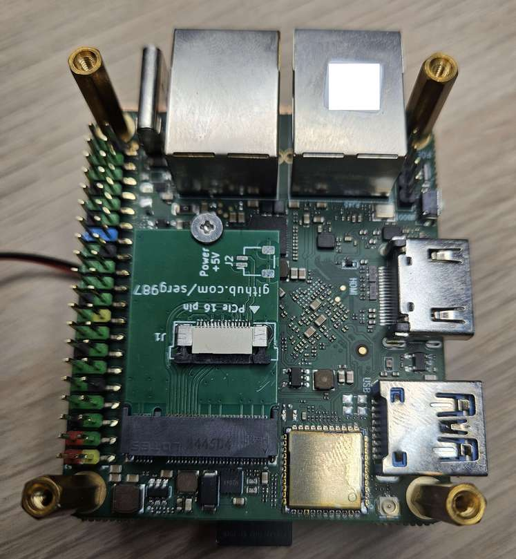
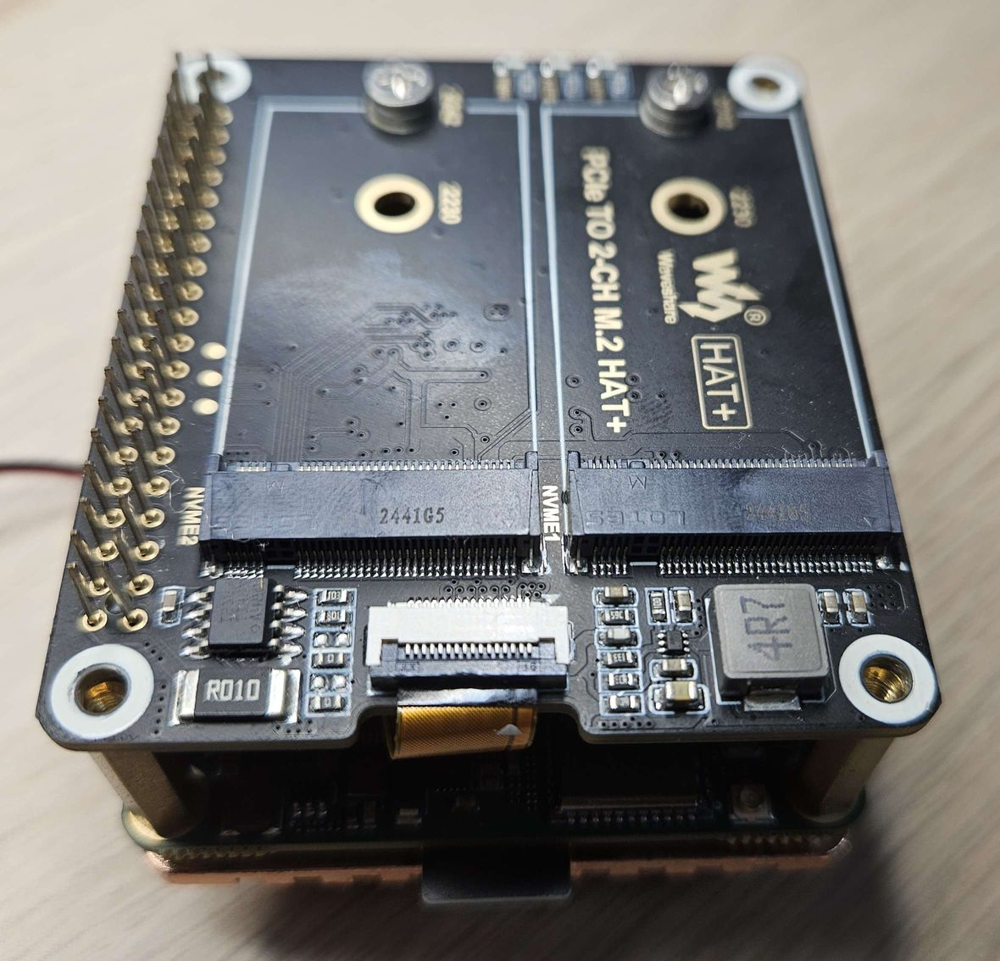

# M.2 Key M to Raspberry Pi PCIe adapter

Allows use of Raspberry Pi HATs with the Radxa A5E SBC. Requires a Raspberry Pi PCIe FPC cable at least 40 mm long.

The board was manufactured and electrically tested — it is recognized by the Radxa A5E. Due to Radxa's limited 
third‑party support, development will not continue. The design can still serve as a baseline for other projects.

## BOM

- 16‑pin 0.5 mm 'bottom' FPC connector  
- Optional 5 V power-supply connector — any 2‑pin 1.0 mm pitch SMD connector
